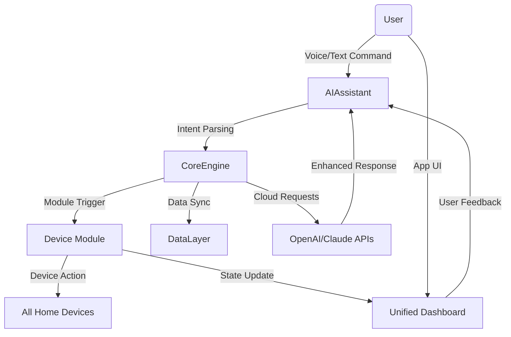

# NeuroHome Hub 🧠🏠

> **Next-generation AI-Enhanced Smart Home Controller: Orchestrate devices, routines, and user preferences through modular intelligence and privacy-first design.**

---

## 🚀 Overview

**NeuroHome Hub** bridges the gap between smart home management and personal AI intelligence. Imagine a **hyper-personalized, modular central nervous system for your living space**: every light switch, thermostat, security camera, and voice command harmonized by your own AI layer—designed for privacy, customizability, and flexibility.

Inspired by the concept of the _personal neuro layer_, this project empowers you to run a fully capable, **offline-first, AI-powered home automation assistant** right inside your house. With seamless OpenAI and Claude API integration, extend your hub's IQ on your terms.

If the modern "smart home" often feels fragmented, think of this as your orchestra conductor—turning cacophony into customized symphony.

---

## 📥 Download

Get the latest stable release:

---

## Table of Contents

- [Features](#features-🌟)
- [SEO-Optimized Benefits](#seo-optimized-benefits-🔍)
- [How It Works (Mermaid Diagram)](#how-it-works-mermaid-diagram-🗺️)
- [Example Profile Configuration](#example-profile-configuration-⚙️)
- [Example Console Invocation](#example-console-invocation-🖥️)
- [OpenAI and Claude Integration](#openai--claude-api-integration-🤖)
- [OS Compatibility Table](#os-compatibility-🖳)
- [License](#license-📜)
- [Disclaimer](#disclaimer-⚠️)
- [Download (Repeat)](#📥-download)

---

## Features 🌟

- **Modular Automation Engine**: Plug-and-play custom modules for devices, automations, and data sources.
- **Personal AI Assistant**: On-device LLMs empowered by OpenAI/Claude APIs for context-aware responses.
- **Multilingual Support**: Intuitive interface and voice controls in over 12 languages.
- **Seamless Privacy Mode**: Stay in control—disable cloud APIs and run everything offline.
- **Smart Scheduling**: Adaptive routines using reinforcement learning for daily optimization.
- **24/7 Customer Support**: Connect directly to our round-the-sundial assistance experts.
- **API-First Design**: Extend your home’s intelligence with a comprehensive RESTful API.
- **Unified Device Dashboard**: All devices, all platforms, in one real-time UI.
- **Responsive UI/UX**: Web app adapts fluidly across desktops, tablets, and mobiles.
- **Automated Energy Saver**: AI-driven analysis to minimize your bills and carbon footprint.
- **OS Flexibility**: Windows, macOS, Linux, and Pi—all from one codebase.
- **Voice Recognition & Personalization**: Advanced speaker identification for secure routines.
- **Granular Role-Based Access**: Family-safe controls; customizable permissions.

---

## SEO-Optimized Benefits 🔍

- **Smart Home AI Automation for Modern Living**: Transform any living space into a self-optimizing, user-adaptive environment.
- **Privacy-Centered AI Home Control**: Safeguard your data and routines with modular privacy tools.
- **Adaptive Home Intelligence Layer**: Raise your quality of life by putting intelligence directly into your walls—not the cloud.
- **Energy-Efficient Smart Assistant**: Reduce wasted resources, maximize device efficiency with cutting-edge neural learning.
- **Cutting-Edge Home Automation Platform**: One central platform for all your devices, no vendor lock-in.
- **Secure, Modular, and Resilient Home Orchestration**: AI-managed automation that’s robust to outages and network disruptions.

---

## How It Works (Mermaid Diagram) 🗺️

---

## Example Profile Configuration ⚙️

_user_profile.yaml_

    user:
      name: Jamie
      languages:
        - en
        - es
      preferred_voice: "Astra (en-GB)"
      privacy_level: "strict"
      notifications:
        - type: mobile
        - type: voice
      devices:
        living_room_light: "Philips Hue"
        kitchen_thermostat: "Nest"
        security_camera: "Reolink"
      ai_assistants:
        schedule_optimizer:
          enabled: true
          learning_rate: 0.1
        voice_greeting:
          enabled: true
      allowed_integrations:
        - openai
        - local_llm
      custom_routines:
        - name: "Waking Up"
          trigger: "6:30 am"
          actions:
            - turn_on: living_room_light
            - set: kitchen_thermostat, "21C"
            - play: "Favorite Morning Playlist"

--- 

## Example Console Invocation 🖥️

    neurohome run --profile configs/user_profile.yaml --ui web --api-key-openai {YOUR_OPENAI_API_KEY}

> Command line flexibility ensures fast debugging, easy scripting, and robust automation — ideal for sysadmins and innovators.

---

## OpenAI & Claude API Integration 🤖

**NeuroHome Hub** enables _dynamic reasoning, advanced language understanding_, and conversational context retention via optional integration with OpenAI GPT-4 and Claude 2 APIs. Set up your API keys in the environment or configuration file, and choose whether your AI assistant draws insights from powerful cloud models or keeps everything localized for maximal privacy.

- Configure use of external LLMs per routine, user, or device.
- Enable cloud fallback: local LLM fails → API switches on.
- Seamless switching allows privacy levels per action or device.
- Results aggregated and logged for transparency.

---

## OS Compatibility 🖳

| Platform        | Status     | Emoji    |
| --------------  | -----------|----------|
| Ubuntu 22.04+   | ✅ Supported | 🟢      |
| macOS 13+       | ✅ Supported | 🍏      |
| Windows 11      | ✅ Supported | 🟦      |
| Raspberry Pi OS | ✅ Supported | 🍓      |
| Docker          | ✅ Supported | 🐳      |
| *BSD Flavors    | ⚠️ Partial  | 🟠      |
| Android         | ❌ Planned  | 📱      |

---

## License 📜

_Copyright (c) 2026 NeuroHome Hub contributors_

Released under the MIT License.

[See LICENSE](LICENSE)

---

## Disclaimer ⚠️

> NeuroHome Hub is provided “as is” without any warranty of fitness for a particular purpose. While designed for privacy and security, it’s the user’s responsibility to secure their infrastructure against unauthorized access. This project, and its contributors, assume no liability arising from usage—hardware, software, cloud APIs, or integration risks are undertaken at your own discretion.

---

## 📥 Download

Experience the future of home AI:

---

**Last updated: 2026**